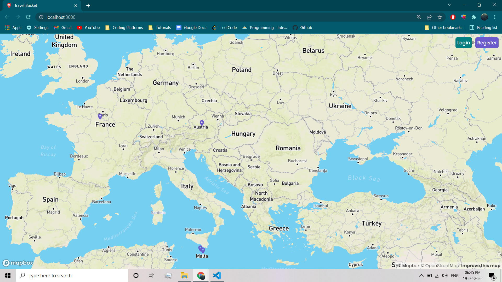
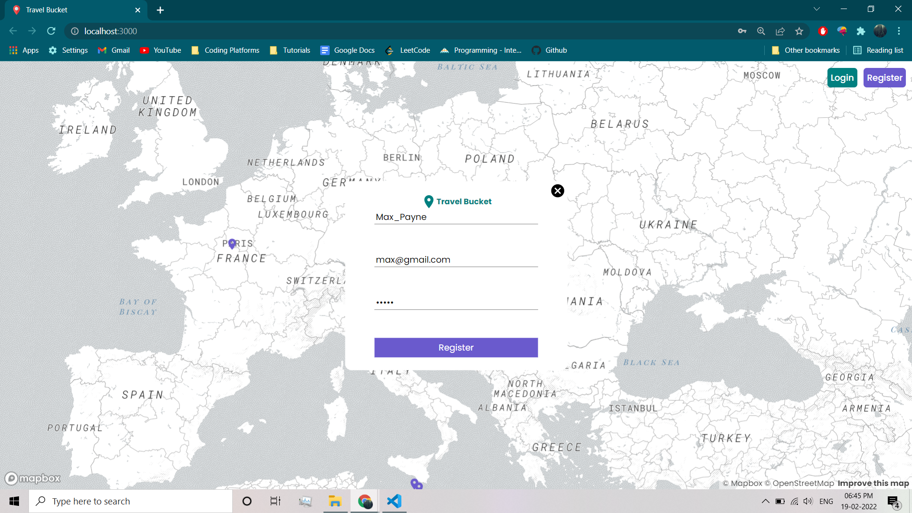
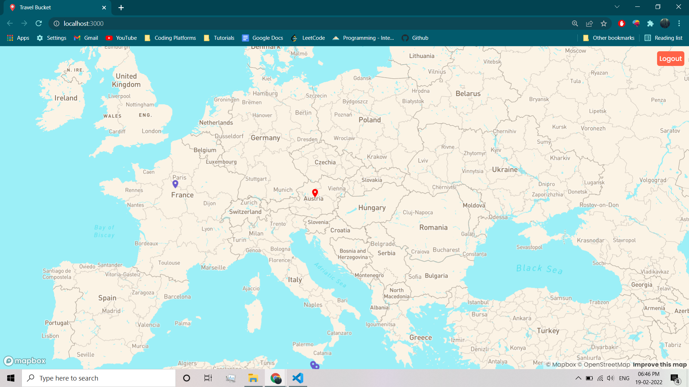

# Travel-Map
A simplistic scratch map application intended to create a community for explorers all around the world to share their amazing experiences with each other. This is just the start of something extraordinary so that not so experienced could also start their journey.
  
## Documentation
This project is divided into two parts client and the API so you will need to have your MongoDB password and MAPBOX API token stored in the respective folders.
Use the following commands in the both the folders

1. Install the requirements run
```bash
  npm install
```

2. Start the project
```bash
  npm start
```
## Features

- Minimalist and elegant User Interface.
- Keeps track of your previous records.
- Provides information about different users.

## Demo




